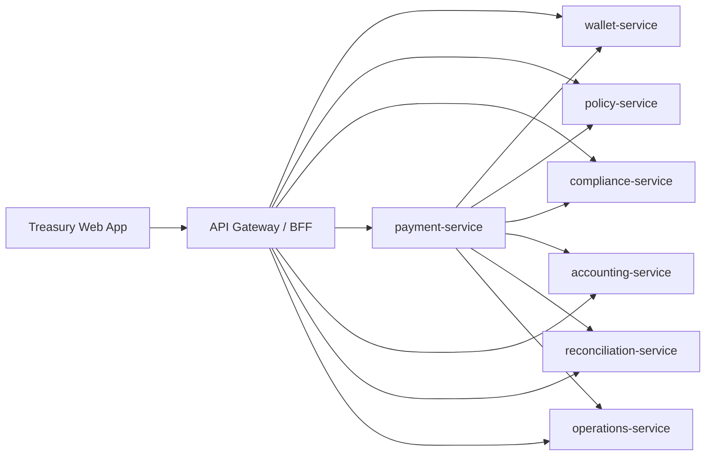

# Microservices Architecture

## Shape

The app is now split into a browser client, an API gateway/BFF, and independently runnable domain services.

## Services

- `api-gateway`: serves the web app, composes `/api/state`, and exposes BFF commands for the browser.
- `wallet-service`: owns legal entities, assets, wallets, balances, and debits.
- `policy-service`: owns approval thresholds, asset allowlists, and payment policy evaluation.
- `compliance-service`: owns counterparty records and screening results.
- `payment-service`: owns payment lifecycle state and orchestrates execution across services.
- `accounting-service`: owns journal entries and export status.
- `reconciliation-service`: owns matching records and exceptions.
- `operations-service`: owns providers, alerts, and audit events.

## 2026-Style Defaults Used Here

- Domain-owned services instead of one giant app state.
- API gateway/BFF for browser composition.
- Health and readiness endpoints on every service.
- Container-friendly service boundaries with Docker Compose.
- Command endpoints are explicit and idempotency-ready.
- Audit events are emitted by workflow transitions.
- Durable service-local JSON stores for the prototype, with service boundaries ready for Postgres/event store replacement.
- Bounded request bodies, structured logs, request IDs, graceful shutdown, and `/metrics`.
- Service-to-service timeouts and retries for safe reads.

## Local Ports

- Gateway: `8080`
- Wallet: `4101`
- Policy: `4102`
- Compliance: `4103`
- Payment: `4104`
- Accounting: `4105`
- Reconciliation: `4106`
- Operations: `4107`

In Docker Compose, only the gateway port is published to the host. Domain service ports remain available inside the Compose network. When using `npm run dev`, all services bind to loopback for local debugging.

## Runtime Reliability

- Every service persists state under `DATA_DIR`.
- Wallet debits require an `Idempotency-Key`.
- Payment creation stores idempotency mappings when the edge supplies a key.
- Accounting journal creation and reconciliation matching are idempotent by payment ID.
- Payment execution can resume from `Executing` by replaying the idempotent debit and downstream writes without re-running the original policy decision.
- Gateway `/ready` checks all downstream service health.
- `docker-compose.yml` includes service health checks, restart policies, and a persistent volume.
