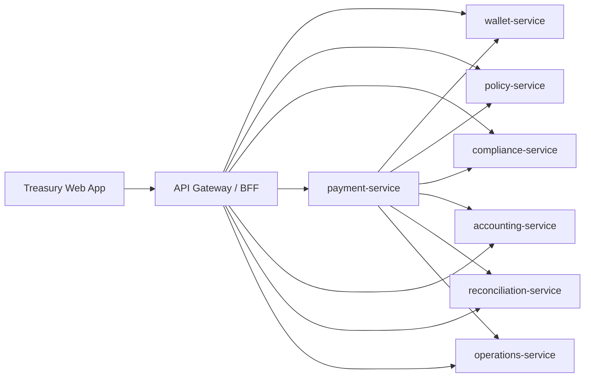

# Microservices Architecture

## Shape

The app is now split into a browser client, an API gateway/BFF, and independently runnable domain services.

## Services

- `api-gateway`: serves the web app, composes `/api/state`, and exposes BFF commands for the browser.
- `wallet-service`: owns legal entities, assets, wallets, balances, and debits.
- `policy-service`: owns approval thresholds, asset allowlists, and payment policy evaluation.
- `compliance-service`: owns counterparty records and screening results.
- `payment-service`: owns payment lifecycle state and orchestrates execution across services.
- `accounting-service`: owns journal entries and export status.
- `reconciliation-service`: owns matching records and exceptions.
- `operations-service`: owns providers, alerts, and audit events.

## 2026-Style Defaults Used Here

- Domain-owned services instead of one giant app state.
- API gateway/BFF for browser composition.
- Health and readiness endpoints on every service.
- Container-friendly service boundaries with Docker Compose.
- Command endpoints are explicit and idempotency-ready.
- Audit events are emitted by workflow transitions.
- One Postgres database, schema-per-service (`wallet`, `policy`, `compliance`, `payment`,
  `accounting`, `reconciliation`, `operations`, `identity`), with real constraints: non-negative
  balances, a deferred trigger that rejects unbalanced journal batches at commit, unique
  idempotency keys, and unique-per-payment dedupe indexes for journals and reconciliation matches.
- Every table carries `tenant_id` from its first migration (`db/migrations/0001_identity.sql`)
  even though there is only one seeded tenant today -- see `packages/shared/tenant.mjs`.
- Bounded request bodies, structured logs, request IDs, graceful shutdown, and `/metrics`.
- Service-to-service timeouts and retries for safe reads.

## Local Ports

- Gateway: `8080`
- Wallet: `4101`
- Policy: `4102`
- Compliance: `4103`
- Payment: `4104`
- Accounting: `4105`
- Reconciliation: `4106`
- Operations: `4107`

In Docker Compose, only the gateway port is published to the host. Domain service ports remain available inside the Compose network. When using `npm run dev`, all services bind to loopback for local debugging.

## Runtime Reliability

- Every service persists state in its own Postgres schema (`DATABASE_URL`, default
  `postgres://127.0.0.1:5432/treasury_dev`). Run `npm run db:setup` once to create the dev and
  test databases and apply migrations, or `npm run migrate` against any `DATABASE_URL`.
- Wallet debits require an `Idempotency-Key`; the check-and-debit is one `UPDATE ... WHERE
  balance >= $1` statement, so Postgres itself -- not application code -- prevents overdraft
  under concurrent debits.
- Payment creation, approval, and execution use `INSERT ... ON CONFLICT` reservations and
  `SELECT ... FOR UPDATE` row locks instead of in-process locking, so the guarantees hold even if
  a service is ever run with more than one instance.
- Accounting journal creation and reconciliation matching are idempotent by payment ID, backed by
  unique constraints (`db/migrations/0009_dedupe_constraints.sql`) so a race between the
  existence check and the insert can't produce duplicates.
- Payment execution can resume from `Executing` by replaying the idempotent debit and downstream
  writes without re-running the original policy decision.
- Gateway `/ready` checks all downstream service health; each service's own `/ready` checks its
  database connection.
- `docker-compose.yml` includes a `db-migrate` one-shot job every service depends on, Postgres
  with a persistent volume, service health checks, and restart policies.

See `docs/DATABASE.md` for the schema layout and migration workflow.
