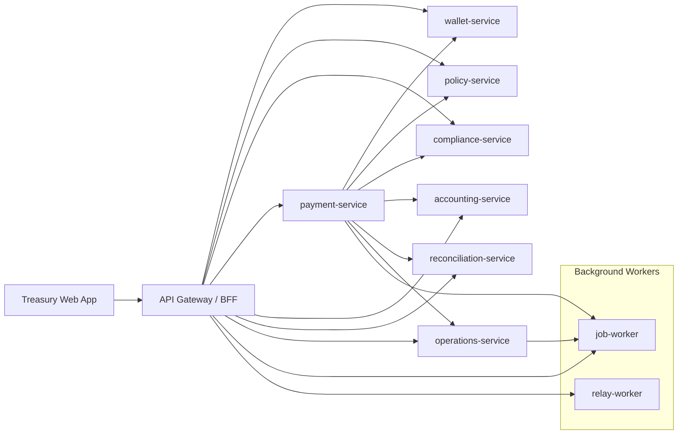

# Microservices Architecture

## Shape

The app is now split into a browser client, an API gateway/BFF, and 10 independently runnable domain services (8 domain services + 2 background workers).

## Services

- `api-gateway`: serves the web app, composes `/api/state`, and exposes BFF commands for the browser.
- `wallet-service`: owns legal entities, assets, wallets, balances, and debits.
- `policy-service`: owns approval thresholds, asset allowlists, and payment policy evaluation.
- `compliance-service`: owns counterparty records and screening results.
- `payment-service`: owns payment lifecycle state and orchestrates execution across services.
- `accounting-service`: owns journal entries and export status.
- `reconciliation-service`: owns matching records and exceptions. Also ingests provider statements and matches them against internal payments (V6 Epic 5.2).
- `operations-service`: owns providers, alerts, and audit events.
- `job-worker`: background job executor — runs payment expiry, audit-chain verification, watchdog, and outbox relay.
- `relay-worker`: outbox event relay — delivers outbox events to internal service inbox endpoints.

## Tenants

The platform currently supports 2 tenants:

| Tenant ID | Name | Users |
|-----------|------|-------|
| `00000000-0000-0000-0000-000000000001` | Default (Vega Industries) | Marta Klein (admin), approver, treasury-manager, analyst |
| `00000000-0000-0000-0000-000000000002` | Nordic Holdings AB | Erik Johansson (admin), Maria Schmidt (analyst) |

Every table carries `tenant_id` from its first migration (`db/migrations/0001_identity.sql`). Application queries scope by `tenant_id` from the verified request context. Cross-tenant access returns 404. See `packages/shared/tenant.mjs` for tenant resolution logic.

### RLS (Row-Level Security)

Row-level security policies are applied on all tenant-scoped tables in every schema:

- **`identity`** — `users`, `sessions`, `user_roles`, `pending_invites`
- **`wallet`** — `legal_entities`, `assets`, `wallets`, `wallet_balances`, `ledger_accounts`, `ledger_transactions`, `ledger_entries`, `wallet_debit_reservations`
- **`policy`** — `policies`, `asset_policies`, `approval_rules`
- **`compliance`** — `counterparties`, `screening_results`
- **`payment`** — `payments`, `payment_events`, `payment_approvals`, `payment_attempts`
- **`accounting`** — `journal_entries`, `journal_export_batches`
- **`reconciliation`** — `reconciliation_rows`, `provider_statements`, `statement_lines`
- **`operations`** — `providers`, `provider_assets`, `alerts`, `audit_events`
- **`platform`** — `jobs`, `outbox_events`, `webhook_events`

The RLS policy uses `current_setting('app.tenant_id')` as the session-level tenant context, set by the `db.mjs` `runWithTenant()` / `withTransaction()` helpers. Services with `BYPASSRLS` (relay-worker, job-worker) can operate across all tenants. See `db/migrations/0044_rls_platform.sql` and `db/migrations/0037_rls_*.sql` for the full RLS setup.

### Audit Chain

Every `operations.audit_events` row commits to its predecessor via a hash chain:

- Per-tenant monotonically increasing `chain_seq`
- Each row stores `prev_hash` (previous row's hash) and `row_hash` (SHA-256 over canonical serialization)
- Genesis rows use `prev_hash = ''`
- Concurrent appends serialize per tenant via `pg_advisory_xact_lock`
- A nightly verifier (`scripts/verify-audit-chain.mjs`) recomputes every hash and raises an alert on break

See `packages/shared/audit.mjs` for the hash-chain implementation, and `tests/integration/audit-chain.test.mjs` for adversarial tests covering tamper detection, interior deletion, concurrent appends, demo-reset chain restart, and the alert lifecycle.

## 2026-Style Defaults Used Here

- Domain-owned services instead of one giant app state.
- API gateway/BFF for browser composition.
- Health and readiness endpoints on every service.
- Container-friendly service boundaries with Docker Compose.
- Command endpoints are explicit and idempotency-ready.
- Audit events are emitted by workflow transitions with tamper-evident hash chaining.
- One Postgres database, schema-per-service (`wallet`, `policy`, `compliance`, `payment`,
  `accounting`, `reconciliation`, `operations`, `platform`, `identity`), with real constraints: non-negative
  balances, a deferred trigger that rejects unbalanced journal batches at commit, unique
  idempotency keys, and unique-per-payment dedupe indexes for journals and reconciliation matches.
- Every table carries `tenant_id` from its first migration (`db/migrations/0001_identity.sql`)
  — see `packages/shared/tenant.mjs`.
- RLS policies on every tenant-scoped table enforce cross-tenant isolation at the database level.
- Bounded request bodies, structured logs, request IDs, graceful shutdown, and `/metrics`.
- Service-to-service timeouts and retries for safe reads.

## Local Ports

- Gateway: `8080`
- Wallet: `4101`
- Policy: `4102`
- Compliance: `4103`
- Payment: `4104`
- Accounting: `4105`
- Reconciliation: `4106`
- Operations: `4107`
- Job Worker: `4108`
- Relay Worker: `4109`

In Docker Compose, only the gateway port is published to the host. Domain service ports remain available inside the Compose network. When using `npm run dev`, all services bind to loopback for local debugging.

## Runtime Reliability

- Every service persists state in its own Postgres schema (`DATABASE_URL`, default
  `postgres://127.0.0.1:5432/treasury_dev`). Run `npm run db:setup` once to create the dev and
  test databases and apply migrations, or `npm run migrate` against any `DATABASE_URL`.
- Wallet debits require an `Idempotency-Key`; the check-and-debit is one `UPDATE ... WHERE
  balance >= $1` statement, so Postgres itself — not application code — prevents overdraft
  under concurrent debits.
- Payment creation, approval, and execution use `INSERT ... ON CONFLICT` reservations and
  `SELECT ... FOR UPDATE` row locks instead of in-process locking, so the guarantees hold even if
  a service is ever run with more than one instance.
- Accounting journal creation and reconciliation matching are idempotent by payment ID, backed by
  unique constraints (`db/migrations/0009_dedupe_constraints.sql`) so a race between the
  existence check and the insert can't produce duplicates.
- Payment execution can resume from `Executing` by replaying the idempotent debit and downstream
  writes without re-running the original policy decision.
- Gateway `/ready` checks all downstream service health; each service's own `/ready` checks its
  database connection.
- `docker-compose.yml` includes a `db-migrate` one-shot job every service depends on, Postgres
  with a persistent volume, service health checks, and restart policies.

See `docs/DATABASE.md` for the schema layout and migration workflow.
