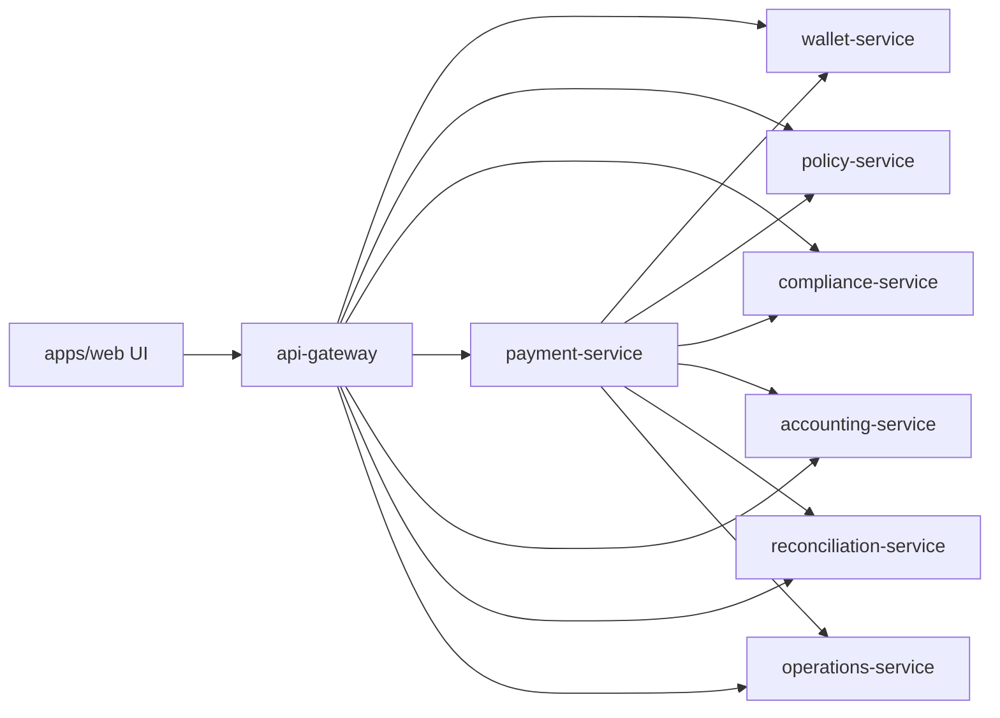

# Server Onboarding Documentation

Scope: `/Users/notabanker/projects/corporate-stablecoin-treasury-platform`

Scan date: 2026-07-03

This document covers the local development server environment for the Corporate Stablecoin Treasury Platform. It documents the project files, runtime services, configuration, dependencies, network endpoints, and onboarding workflow. It does not include any secrets, credentials, private keys, or production connection strings.

## 1. Server Overview

The project is a Node.js microservices prototype for a corporate stablecoin treasury platform. It includes:

- A browser UI served by an API gateway.
- Seven domain services, each with its own HTTP API and local JSON state file.
- Shared HTTP, service-client, seed-data, and durable-store helpers.
- Docker Compose definitions for containerized local orchestration.
- Markdown architecture, readiness, task, and onboarding documentation.

There are no Python application scripts in this project. Python exists on the host OS, but it is not used by this codebase.

| Area | Details |
| --- | --- |
| Primary language | JavaScript, ECMAScript modules (`.mjs`) |
| Runtime | Node.js |
| Frontend | Static HTML/CSS/JavaScript, no build step |
| API style | JSON over HTTP |
| Service pattern | API gateway/BFF plus domain services |
| Persistence | Service-local JSON files in `.data/` for prototype state |
| Container support | `Dockerfile` and `docker-compose.yml` |
| Current local UI | `http://127.0.0.1:8080/` |

Observed local runtime during scan:

| Component | Observed value |
| --- | --- |
| OS | macOS 26.5 on Darwin 25.5.0, ARM64 |
| Node | 26.4.0 |
| npm | 11.17.0 |
| Python | 3.9.6, not used by project |
| Docker CLI | Not found on host during scan |
| Package dependencies | No external npm packages installed or declared |

## 2. Directory Structure

Full project tree at scan time:

```text
corporate-stablecoin-treasury-platform/
├── .DS_Store
├── .data/
│   ├── accounting-service.json
│   ├── compliance-service.json
│   ├── operations-service.json
│   ├── payment-service.json
│   ├── policy-service.json
│   ├── reconciliation-service.json
│   └── wallet-service.json
├── .dockerignore
├── .env.example
├── .gitignore
├── Dockerfile
├── README.md
├── TECHNICAL_TASKS.md
├── apps/
│   └── web/
│       ├── index.html
│       ├── main.js
│       └── styles.css
├── docker-compose.yml
├── docs/
│   ├── ARCHITECTURE.md
│   ├── ONBOARDING.md
│   └── PRODUCTION_READINESS.md
├── package.json
├── packages/
│   └── shared/
│       ├── data.mjs
│       ├── http.mjs
│       ├── service-client.mjs
│       └── store.mjs
├── scripts/
│   ├── dev.mjs
│   └── smoke.mjs
└── services/
    ├── .DS_Store
    ├── accounting-service/
    │   └── src/
    │       └── index.mjs
    ├── api-gateway/
    │   └── src/
    │       └── index.mjs
    ├── compliance-service/
    │   └── src/
    │       └── index.mjs
    ├── operations-service/
    │   └── src/
    │       └── index.mjs
    ├── payment-service/
    │   └── src/
    │       └── index.mjs
    ├── policy-service/
    │   └── src/
    │       └── index.mjs
    ├── reconciliation-service/
    │   └── src/
    │       └── index.mjs
    └── wallet-service/
        └── src/
            └── index.mjs
```

Directory and file purposes:

| Path | Type | Purpose | Sensitivity |
| --- | --- | --- | --- |
| `.data/` | Runtime data | Service-local JSON state generated by the durable store. Used for prototype persistence. | Contains business-like demo data and mutable state; do not commit real production data. |
| `.DS_Store` | OS metadata | macOS Finder metadata. Not part of the app. | Not sensitive, ignored by Git. |
| `.dockerignore` | Docker config | Excludes local state, logs, `.env`, Git metadata, and dependencies from image context. | Public-safe. |
| `.env.example` | Environment template | Lists expected environment variables for local execution. | Public-safe template only; do not place secrets here. |
| `.gitignore` | Git config | Ignores `.data/`, `node_modules/`, `.DS_Store`, `.env`, and logs. | Public-safe. |
| `Dockerfile` | Container config | Builds a Node 20 Alpine runtime image and runs the gateway command by default. | Public-safe. |
| `README.md` | Documentation | Quick project overview, run instructions, service list, reliability notes. | Public-safe. |
| `TECHNICAL_TASKS.md` | Documentation/backlog | Technology task backlog for MVP and later phases. | Public-safe. |
| `apps/web/` | Frontend app | Static web UI served by the gateway from `apps/web`. | Public-safe, no embedded secrets found. |
| `docker-compose.yml` | Local orchestration | Defines all services, ports, health checks, shared data volume, and environment variables. | Public-safe if only local/internal URLs are used. |
| `docs/` | Documentation | Architecture, production-readiness, and onboarding docs. | Public-safe. |
| `package.json` | Node manifest | Defines scripts and Node engine requirement. No external dependencies declared. | Public-safe. |
| `packages/shared/` | Shared code | Common HTTP framework, service client, seed data, and JSON store implementation. | Public-safe, demo data only. |
| `scripts/` | Operational scripts | Local dev process manager and smoke test. | Public-safe. |
| `services/` | Service source | All domain service entry points. | Public-safe, no secrets found. |
| `services/.DS_Store` | OS metadata | macOS Finder metadata inside service folder. | Not sensitive, ignored by Git. |

Runtime JSON store summary:

| File | Owned state | Shape |
| --- | --- | --- |
| `.data/accounting-service.json` | Accounting journal entries | `journalEntries[]` |
| `.data/compliance-service.json` | Counterparty records | `counterparties[]` |
| `.data/operations-service.json` | Providers, alerts, audit trail | `providers[]`, `alerts[]`, `audit[]` |
| `.data/payment-service.json` | Payments and payment idempotency map | `payments[]`, `idempotency{}` |
| `.data/policy-service.json` | Payment policy settings | `policies{}` |
| `.data/reconciliation-service.json` | Reconciliation rows and exceptions | `reconciliation[]` |
| `.data/wallet-service.json` | Entities, assets, wallets, debit idempotency map | `entities[]`, `assets[]`, `wallets[]`, `debitOperations{}` |

## 3. Python Scripts Reference

No `.py` files were found in the project.

No Python dependency manifests were found:

- No `requirements.txt`.
- No `pyproject.toml`.
- No `Pipfile`.
- No `poetry.lock`.

Host Python was observed as `Python 3.9.6`, but it is not part of the application runtime. New engineers should treat this as a Node.js codebase unless a future feature adds Python services.

## 4. Configuration Files

### `package.json`

Purpose: Node project manifest and script registry.

Key properties:

| Key | Meaning |
| --- | --- |
| `type: module` | Enables ECMAScript module syntax. |
| `engines.node` | Requires Node.js `>=20`. |
| `scripts.dev` | Starts all local services through `scripts/dev.mjs`. |
| `scripts.check` | Runs `node --check` syntax validation across frontend, shared code, scripts, and service entry points. |
| `scripts.smoke` | Runs a local integration smoke test. This script resets local prototype state, so use it only on disposable local data. |

Dependencies: none declared. The app uses Node built-ins and browser APIs.

### `.env.example`

Purpose: Template for local runtime environment variables.

No actual `.env` file was found during the scan. If one is created, it is ignored by Git and must not be committed.

Required and optional variables:

| Variable | Required | Description | Secret |
| --- | --- | --- | --- |
| `GATEWAY_PORT` | No | Gateway listen port. Defaults to gateway code fallback. | No |
| `PORT` | No | Service listen port for individual services. | No |
| `HOST` | No | Bind host. Local script uses loopback by default; Compose uses container-wide bind. | No |
| `DATA_DIR` | No | Directory for service JSON state. Defaults to local `.data`. | No, but stored data can be sensitive in real environments. |
| `HTTP_BODY_LIMIT_BYTES` | No | Maximum JSON request body size. | No |
| `HTTP_REQUEST_TIMEOUT_MS` | No | HTTP server request timeout. | No |
| `HTTP_HEADERS_TIMEOUT_MS` | No | HTTP server headers timeout. | No |
| `SHUTDOWN_TIMEOUT_MS` | No | Graceful shutdown timeout before forced exit. | No |
| `SERVICE_TIMEOUT_MS` | No | Timeout for service-to-service requests. | No |
| `SERVICE_RETRIES` | No | Retry count for retry-safe service reads. | No |
| `CORS_ORIGIN` | No | Allowed browser origin. Defaults to permissive wildcard if unset. | No |
| `WALLET_SERVICE_URL` | No | Internal URL for wallet service. | No |
| `POLICY_SERVICE_URL` | No | Internal URL for policy service. | No |
| `COMPLIANCE_SERVICE_URL` | No | Internal URL for compliance service. | No |
| `PAYMENT_SERVICE_URL` | No | Internal URL for payment service. | No |
| `ACCOUNTING_SERVICE_URL` | No | Internal URL for accounting service. | No |
| `RECONCILIATION_SERVICE_URL` | No | Internal URL for reconciliation service. | No |
| `OPERATIONS_SERVICE_URL` | No | Internal URL for operations service. | No |
| `SMOKE_BASE_URL` | No | Override base URL for `scripts/smoke.mjs`. | No |
| `NODE_ENV` | No | Runtime environment marker; Dockerfile sets production inside image. | No |

Sanitized environment template:

```text
GATEWAY_PORT=<PORT>
DATA_DIR=<DATA_DIRECTORY>
HOST=<BIND_HOST>
HTTP_BODY_LIMIT_BYTES=<BYTE_LIMIT>
SERVICE_TIMEOUT_MS=<MILLISECONDS>
SERVICE_RETRIES=<COUNT>
CORS_ORIGIN=<ALLOWED_ORIGIN>
WALLET_SERVICE_URL=<WALLET_SERVICE_URL>
POLICY_SERVICE_URL=<POLICY_SERVICE_URL>
COMPLIANCE_SERVICE_URL=<COMPLIANCE_SERVICE_URL>
PAYMENT_SERVICE_URL=<PAYMENT_SERVICE_URL>
ACCOUNTING_SERVICE_URL=<ACCOUNTING_SERVICE_URL>
RECONCILIATION_SERVICE_URL=<RECONCILIATION_SERVICE_URL>
OPERATIONS_SERVICE_URL=<OPERATIONS_SERVICE_URL>
```

### `docker-compose.yml`

Purpose: Local multi-service orchestration.

Defines:

- `wallet-service`
- `policy-service`
- `compliance-service`
- `payment-service`
- `accounting-service`
- `reconciliation-service`
- `operations-service`
- `api-gateway`
- Persistent named volume `service-data`

Each service:

- Builds from the same project Dockerfile.
- Runs a service-specific `node services/.../src/index.mjs` command.
- Uses `restart: unless-stopped`.
- Writes state to `/data`.
- Has a health check against `/health` or `/ready`.

Important note: The Compose file publishes only the gateway port to the host. Internal services communicate on the Compose network and should remain private.

### `Dockerfile`

Purpose: Builds a container image for the Node service runtime.

Behavior:

- Uses Node 20 Alpine.
- Sets `/app` as the working directory.
- Copies `package.json`, `apps/`, `packages/`, and `services/`.
- Sets `NODE_ENV=production`.
- Creates `/data`.
- Runs as non-root `node`.
- Defaults to running `services/api-gateway/src/index.mjs`.

### `.gitignore`

Purpose: Prevents local/generated files from being committed.

Ignored:

- `.data/`
- `node_modules/`
- `.DS_Store`
- `.env`
- `*.log`

### `.dockerignore`

Purpose: Prevents local/generated files from being sent to Docker build context.

Ignored:

- `.data`
- `.DS_Store`
- `.env`
- `.git`
- `node_modules`
- `*.log`

### Markdown docs

| File | Purpose |
| --- | --- |
| `README.md` | Primary project overview and run instructions. |
| `docs/ARCHITECTURE.md` | Architecture diagram, service list, local ports, and reliability defaults. |
| `docs/PRODUCTION_READINESS.md` | What is hardened and what remains required before real treasury use. |
| `TECHNICAL_TASKS.md` | Detailed technical backlog and future implementation tasks. |
| `docs/ONBOARDING.md` | This onboarding package. |

## 5. Services & Scheduled Tasks

### Service inventory

| Service | Entry point | Port | State file | Responsibility |
| --- | --- | ---: | --- | --- |
| `api-gateway` | `services/api-gateway/src/index.mjs` | 8080 | none directly | Serves the web UI, composes `/api/state`, exposes browser-facing command endpoints. |
| `wallet-service` | `services/wallet-service/src/index.mjs` | 4101 | `.data/wallet-service.json` | Owns entities, assets, wallets, balances, and idempotent debits. |
| `policy-service` | `services/policy-service/src/index.mjs` | 4102 | `.data/policy-service.json` | Owns thresholds, allowlists, and policy evaluation. |
| `compliance-service` | `services/compliance-service/src/index.mjs` | 4103 | `.data/compliance-service.json` | Owns counterparties and seeded screening status. |
| `payment-service` | `services/payment-service/src/index.mjs` | 4104 | `.data/payment-service.json` | Owns payment lifecycle and orchestrates execution across services. |
| `accounting-service` | `services/accounting-service/src/index.mjs` | 4105 | `.data/accounting-service.json` | Owns journal entries and export status. |
| `reconciliation-service` | `services/reconciliation-service/src/index.mjs` | 4106 | `.data/reconciliation-service.json` | Owns reconciliation matches and exceptions. |
| `operations-service` | `services/operations-service/src/index.mjs` | 4107 | `.data/operations-service.json` | Owns providers, alerts, and audit events. |

### Runtime process manager

Local development uses `scripts/dev.mjs`, not systemd, supervisor, or launchd. It spawns one Node child process per service and prefixes logs with the service name. If any child exits unexpectedly, the script shuts down the remaining children.

Observed local process model during scan:

```text
node scripts/dev.mjs
├── node services/wallet-service/src/index.mjs
├── node services/policy-service/src/index.mjs
├── node services/compliance-service/src/index.mjs
├── node services/accounting-service/src/index.mjs
├── node services/reconciliation-service/src/index.mjs
├── node services/operations-service/src/index.mjs
├── node services/payment-service/src/index.mjs
└── node services/api-gateway/src/index.mjs
```

### Scheduled tasks

No project-specific scheduled tasks were found.

| Scheduler | Scan result |
| --- | --- |
| Cron | No crontab entries returned. |
| launchd | No project-specific entries found. One Codex application entry was present and is unrelated to this app. |
| Docker containers | No running containers returned during scan. |
| systemd | Not applicable on this macOS host. |
| supervisor | No supervisor configuration found in the project. |

### Safe operational commands

Start the local stack:

```bash
npm run dev
```

Run syntax checks:

```bash
npm run check
```

Check service readiness:

```bash
curl -sS http://127.0.0.1:8080/ready
```

Read gateway endpoint metadata:

```bash
curl -sS http://127.0.0.1:8080/api/docs
```

Inspect local listening ports:

```bash
lsof -nP -iTCP -sTCP:LISTEN
```

Stop the local stack:

```text
Press Ctrl+C in the terminal running npm run dev.
```

Note: `npm run smoke` is useful but intentionally resets and mutates local demo state. Run it only when that local state is disposable.

## 6. Network & Endpoints

### Open local ports observed during scan

| Port | Service | Bind address | Purpose |
| ---: | --- | --- | --- |
| 8080 | `api-gateway` | `127.0.0.1` | Browser UI and BFF API. |
| 4101 | `wallet-service` | `127.0.0.1` in `npm run dev`; internal-only in Compose | Entity, asset, wallet, debit API. |
| 4102 | `policy-service` | `127.0.0.1` in `npm run dev`; internal-only in Compose | Policy and evaluation API. |
| 4103 | `compliance-service` | `127.0.0.1` in `npm run dev`; internal-only in Compose | Counterparty and screening API. |
| 4104 | `payment-service` | `127.0.0.1` in `npm run dev`; internal-only in Compose | Payment lifecycle API. |
| 4105 | `accounting-service` | `127.0.0.1` in `npm run dev`; internal-only in Compose | Journal and export API. |
| 4106 | `reconciliation-service` | `127.0.0.1` in `npm run dev`; internal-only in Compose | Reconciliation and exception API. |
| 4107 | `operations-service` | `127.0.0.1` in `npm run dev`; internal-only in Compose | Provider, audit, alert API. |

### Gateway browser endpoints

| Method | Path | Purpose |
| --- | --- | --- |
| `GET` | `/` | Serves `apps/web/index.html`. |
| `GET` | `/main.js` | Serves frontend JavaScript. |
| `GET` | `/styles.css` | Serves frontend CSS. |
| `GET` | `/health` | Gateway health check. |
| `GET` | `/ready` | Checks downstream service health. |
| `GET` | `/metrics` | Gateway request counters and average duration. |
| `GET` | `/api/docs` | Returns gateway service map and endpoint list. |
| `GET` | `/api/state` | Composes state across all domain services for the UI. |
| `POST` | `/api/reset` | Resets all service stores to seed state. Destructive to local prototype state. |
| `POST` | `/api/payments` | Creates a payment. |
| `POST` | `/api/payments/:id/approve` | Approves a pending payment. |
| `POST` | `/api/payments/:id/execute` | Executes an approved payment. |
| `POST` | `/api/payments/:id/cancel` | Cancels a pending or approved payment. |
| `POST` | `/api/policies` | Updates policy thresholds. |
| `POST` | `/api/policies/assets/:assetId` | Toggles an asset in the allowlist. |
| `POST` | `/api/reconciliation/:id/resolve` | Resolves an open reconciliation exception. |
| `POST` | `/api/reconciliation/exceptions/simulate` | Creates a synthetic reconciliation exception. |
| `POST` | `/api/operations/providers/:id/toggle` | Toggles provider status. |
| `POST` | `/api/operations/incidents/simulate` | Creates a synthetic provider incident. |
| `POST` | `/api/accounting/export` | Marks ready journal entries as exported. |

### Internal service endpoints

All services expose:

| Method | Path | Purpose |
| --- | --- | --- |
| `GET` | `/health` | Liveness check. |
| `GET` | `/ready` | Readiness check. |
| `GET` | `/metrics` | Request counter snapshot. |
| `POST` | `/reset` | Reset the service-local JSON store. Destructive to local prototype state. |

Domain endpoints:

| Service | Endpoint | Purpose |
| --- | --- | --- |
| `wallet-service` | `GET /entities` | List legal entities. |
| `wallet-service` | `GET /entities/:id` | Read one legal entity. |
| `wallet-service` | `GET /assets` | List supported assets. |
| `wallet-service` | `GET /assets/:id` | Read one asset. |
| `wallet-service` | `GET /wallets` | List wallets. |
| `wallet-service` | `GET /wallets/:id` | Read one wallet. |
| `wallet-service` | `POST /wallets/:id/debit` | Debit wallet balance with required idempotency key. |
| `policy-service` | `GET /policies` | Read policy settings. |
| `policy-service` | `POST /policies` | Update numeric policy thresholds. |
| `policy-service` | `POST /policies/assets/:assetId` | Toggle allowed assets. |
| `policy-service` | `POST /evaluate` | Evaluate payment context against policies. |
| `compliance-service` | `GET /counterparties` | List counterparties. |
| `compliance-service` | `GET /counterparties/:id` | Read one counterparty. |
| `compliance-service` | `POST /screen` | Return seeded screening result. |
| `payment-service` | `GET /payments` | List payments. |
| `payment-service` | `GET /payments/:id` | Read one payment. |
| `payment-service` | `POST /payments` | Create payment. |
| `payment-service` | `POST /payments/:id/approve` | Approve payment. |
| `payment-service` | `POST /payments/:id/execute` | Execute payment. |
| `payment-service` | `POST /payments/:id/cancel` | Cancel payment. |
| `accounting-service` | `GET /journals` | List journal entries. |
| `accounting-service` | `POST /journals/from-payment` | Create idempotent journal lines for payment. |
| `accounting-service` | `POST /journals/export` | Mark ready journal lines exported. |
| `reconciliation-service` | `GET /reconciliation` | List reconciliation rows. |
| `reconciliation-service` | `POST /reconciliation/matched` | Create idempotent matched row for payment. |
| `reconciliation-service` | `POST /reconciliation/exceptions` | Create exception row. |
| `reconciliation-service` | `POST /reconciliation/exceptions/simulate` | Create synthetic fee exception. |
| `reconciliation-service` | `POST /reconciliation/:id/resolve` | Resolve exception. |
| `operations-service` | `GET /providers` | List providers. |
| `operations-service` | `GET /providers/:id` | Read one provider. |
| `operations-service` | `POST /providers/:id/toggle` | Degrade or restore provider. |
| `operations-service` | `GET /audit` | List audit events. |
| `operations-service` | `POST /audit` | Append audit event. |
| `operations-service` | `GET /alerts` | List alerts. |
| `operations-service` | `POST /alerts` | Create alert. |
| `operations-service` | `POST /incidents/simulate` | Simulate provider incident. |

### Reverse proxy, firewall, and domain routing

No reverse proxy, TLS ingress, firewall rules, or domain routing configuration exists in this project. The local development stack binds to loopback through `npm run dev`. The Docker Compose file binds services on `0.0.0.0` inside containers, but only publishes the gateway port to the host.

Production must add:

- TLS termination.
- Authenticated ingress.
- Network policy or firewall rules.
- Private service-to-service networking.
- Public exposure limited to the gateway or external API ingress.

## 7. Environment & Dependencies

### Runtime dependency model

The project has no third-party npm dependencies. It uses:

- Node built-ins: `node:http`, `node:fs`, `node:path`, `node:url`, `node:crypto`, `node:child_process`.
- Browser APIs: `fetch`, `FormData`, `Intl`, `crypto.randomUUID`.
- Static HTML and CSS.

### Shared modules

| File | Purpose | Key exports/functions |
| --- | --- | --- |
| `packages/shared/data.mjs` | Seed data, fee calculations, ID helpers, formatting helpers. | `createSeedData`, `createId`, `estimateFee`, `nextPaymentReference`, `roundMoney`, `randomHex` |
| `packages/shared/http.mjs` | Minimal HTTP JSON service framework, routing, static serving, metrics, headers, graceful shutdown. | `createJsonService`, `route`, `ok`, `created`, `noContent`, `httpError` |
| `packages/shared/service-client.mjs` | Service discovery URLs, HTTP client, retries, timeout handling, error normalization. | `serviceGet`, `servicePost`, `serviceRequest` |
| `packages/shared/store.mjs` | Durable JSON state store with atomic writes. | `createDurableStore` |

### Frontend files

| File | Purpose |
| --- | --- |
| `apps/web/index.html` | Root document loaded by gateway. |
| `apps/web/main.js` | Browser app state, rendering, API calls, forms, payment actions, reconciliation actions, operations actions. |
| `apps/web/styles.css` | Responsive operational UI styling. |

Frontend behavior:

- Loads state from `GET /api/state`.
- Renders Overview, Payments, Wallets, Controls, Reconciliation, and Operations screens.
- Sends mutations through gateway command endpoints.
- Escapes rendered text through `escapeHtml`.
- Uses browser-generated idempotency keys for payment creation.

### Restoring from scratch

Safe setup commands:

```bash
cd /Users/notabanker/projects/corporate-stablecoin-treasury-platform
npm run check
npm run dev
```

Then open:

```text
http://127.0.0.1:8080/
```

If Docker is installed in a future environment, Compose can be used for local orchestration:

```bash
docker compose up --build
```

Note: Docker was not installed on the scanned host, so this path was not verified locally.

## 8. Data Flow & Integrations

### High-level request flow



### UI read flow

1. Browser loads `/`.
2. Gateway serves static assets from `apps/web`.
3. Frontend calls `GET /api/state`.
4. Gateway concurrently calls:
   - `wallet-service` for entities, assets, wallets.
   - `compliance-service` for counterparties.
   - `policy-service` for policies.
   - `payment-service` for payments.
   - `accounting-service` for journals.
   - `reconciliation-service` for reconciliation rows.
   - `operations-service` for providers, audit, alerts.
5. Gateway composes a single JSON payload.
6. Frontend renders operational views.

### Payment creation flow

1. Browser submits a payment form to `POST /api/payments`.
2. Gateway forwards to `payment-service` with an idempotency key.
3. `payment-service` loads source wallet, counterparty, and policy context.
4. `payment-service` builds a payment record.
5. `policy-service` evaluates asset allowlist, provider route, balance, counterparty screening, transfer limit, and approvals.
6. If blocked:
   - Payment status becomes `Blocked`.
   - Reconciliation exception is created.
   - Operations alert and audit event are emitted.
7. If allowed or review-only:
   - Payment is stored as `Pending approval`.
   - Audit event is emitted.
8. Gateway returns refreshed composed state.

### Payment execution flow

1. Browser calls `POST /api/payments/:id/approve`.
2. `payment-service` re-evaluates policy and increments approval count.
3. Browser calls `POST /api/payments/:id/execute`.
4. `payment-service` re-evaluates policy.
5. `payment-service` marks payment `Executing`.
6. `wallet-service` debits source wallet using idempotency key `debit:<paymentId>`.
7. `payment-service` marks payment `Settled`, assigns provider and chain references.
8. `accounting-service` creates idempotent journal lines.
9. `reconciliation-service` creates idempotent matched row.
10. `operations-service` appends settlement audit event.
11. Gateway returns refreshed composed state.

### Accounting and reconciliation flow

- `accounting-service` owns journal-entry rows and export status.
- `reconciliation-service` owns matched rows and exceptions.
- Gateway exposes `POST /api/accounting/export` to mark ready journal lines exported.
- Gateway exposes `POST /api/reconciliation/:id/resolve` to mark open exceptions resolved and audit the action.

### External integrations

This codebase uses seeded provider names only. No real external API calls are made.

Named demo providers:

- Arcadia Custody Bank
- Meridian Markets CASP
- Atlas Bank Tokens
- Sentinel Chain Analytics

Production integration work remains required for custody, bank, CASP, AML, FX, ERP/TMS, callbacks, webhook verification, credentials, sandbox/prod separation, and audit retention.

## 9. Getting Started (Onboarding Guide)

### 1. Access the machine

Ask the project owner for approved access to the development machine or repository. Do not request secrets over chat. There are no production credentials in this project.

### 2. Go to the project folder

```bash
cd /Users/notabanker/projects/corporate-stablecoin-treasury-platform
```

### 3. Read these files first

```text
README.md
docs/ARCHITECTURE.md
docs/PRODUCTION_READINESS.md
docs/ONBOARDING.md
TECHNICAL_TASKS.md
```

Recommended reading order:

1. `README.md`
2. `docs/ARCHITECTURE.md`
3. `docs/ONBOARDING.md`
4. `docs/PRODUCTION_READINESS.md`
5. `TECHNICAL_TASKS.md`

### 4. Validate syntax

```bash
npm run check
```

### 5. Start the local stack

```bash
npm run dev
```

Open:

```text
http://127.0.0.1:8080/
```

### 6. Check readiness

```bash
curl -sS http://127.0.0.1:8080/ready
```

Expected shape:

```json
{
  "wallet": "ok",
  "policy": "ok",
  "compliance": "ok",
  "payment": "ok",
  "accounting": "ok",
  "reconciliation": "ok",
  "operations": "ok"
}
```

### 7. Navigate the code

Start with:

```text
services/api-gateway/src/index.mjs
packages/shared/http.mjs
packages/shared/service-client.mjs
packages/shared/store.mjs
apps/web/main.js
```

Then inspect domain services:

```text
services/wallet-service/src/index.mjs
services/policy-service/src/index.mjs
services/compliance-service/src/index.mjs
services/payment-service/src/index.mjs
services/accounting-service/src/index.mjs
services/reconciliation-service/src/index.mjs
services/operations-service/src/index.mjs
```

### 8. Work with state

State is stored in `.data/*.json`. These files are local, generated, and ignored by Git. They are useful for debugging prototype behavior but are not a production persistence model.

If state looks unexpected, inspect the corresponding service file and its JSON store summary. Avoid manually editing `.data` while services are running because writes may be overwritten.

### 9. Stop the stack

Press `Ctrl+C` in the terminal running `npm run dev`.

### 10. Where to get secrets

There are no app secrets in the current project. Future provider credentials, SSO details, database passwords, webhook signing secrets, and API keys must come from the approved secrets manager or project owner. Never add them to source files, `.env.example`, documentation, or committed JSON state.

## 10. Secrets & Security Notes

### Current secret scan result

No live API keys, passwords, tokens, private keys, database connection strings, or credential values were found in the project during this scan.

Matches for secret-like words occurred only in:

- Documentation backlog items that mention future authentication and secrets handling.
- UI code names such as `token()` for asset display formatting.
- Demo provider metadata such as supervisory authority names.

### Files that may contain sensitive data in future

| Path | Risk |
| --- | --- |
| `.env` | May contain service URLs, credentials, provider API keys, database URLs, or auth secrets. Ignored by Git. |
| `.data/*.json` | Currently demo state, but would contain sensitive business data if real customers or transactions are loaded. Ignored by Git. |
| Logs | Structured request logs may contain paths, IDs, and operational metadata. `*.log` is ignored by Git. |
| Docker/Compose overrides | Future override files may include deployment-specific values. Keep secrets out of committed Compose files. |

### Security controls present

- Request IDs.
- JSON parsing with body size limit.
- Basic security headers: `Referrer-Policy`, `X-Content-Type-Options`.
- Graceful shutdown path.
- Health, readiness, and metrics endpoints.
- Atomic JSON writes for local durability.
- Idempotency key requirement for wallet debits.
- Idempotency handling for payment creation, accounting journal creation, and reconciliation matched rows.
- Non-root Docker runtime user.

### Security controls missing before production

- Authentication and authorization.
- Tenant isolation.
- TLS ingress.
- CSRF and stricter CORS policy.
- Rate limiting and WAF controls.
- Real secrets manager.
- Transactional databases.
- Database migrations.
- Backups and restore drills.
- Immutable audit storage.
- Signed webhook verification.
- Provider credential rotation.
- Structured redaction in logs.
- Contract, integration, load, and security tests.

### Secret handling rules for new engineers

1. Never commit `.env`.
2. Never paste API keys, private keys, passwords, tokens, or database URLs into docs or tickets.
3. Use `<REDACTED>` when sharing config examples.
4. Keep production data out of `.data/`.
5. Request credentials through the approved project owner or secrets manager.
6. Rotate any credential that was ever pasted into a shell transcript, chat, issue, or commit.
7. Treat provider, wallet, customer, transaction, and audit data as confidential once real integrations exist.

### Known risk callouts

- `POST /api/reset` and service `POST /reset` endpoints are unauthenticated and destructive to local state.
- `CORS_ORIGIN` defaults to `*` if unset.
- Docker Compose publishes the gateway port only; `npm run dev` still exposes all services on loopback for local debugging.
- JSON files are not safe as production databases.
- There is no user authentication or RBAC enforcement.
- Demo data includes business-like entities, wallets, providers, payments, and audit rows. They are mock records, not real production records.
