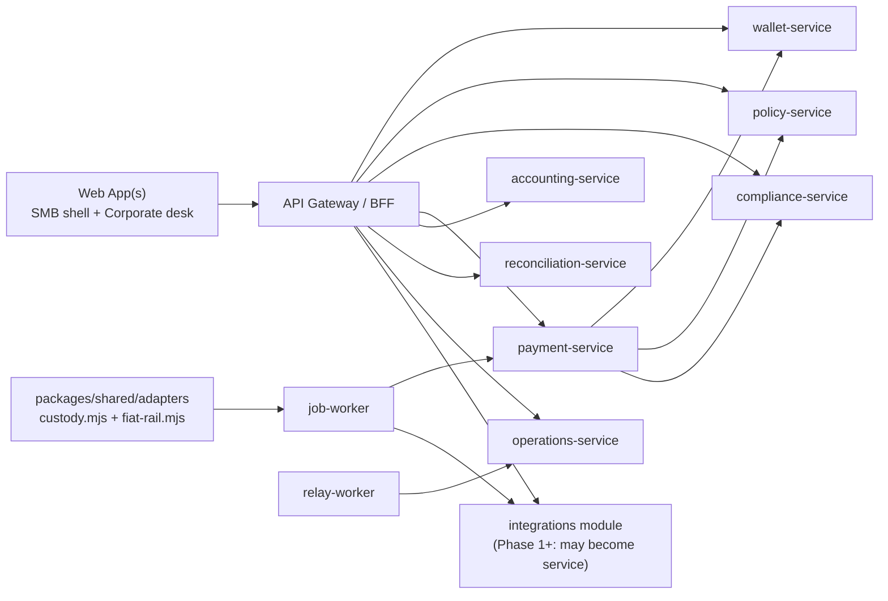

# V8 Implementation Plan — Settlement + Treasury Service (SMB → Corporate)

Drafted: 2026-07-12.  
Status: **Planning** — no V8 epic is started until Phase 0 (money-path safety) is complete.  
Supersedes: V7 as the *product* milestone name; V6 audit findings and Task 5.3 constraints remain binding.

## Document map

| Section | Contents |
|---|---|
| §1–2 | Positioning, baseline, objectives |
| §3 | Human approval gates |
| §4 | Phased roadmap overview |
| §5 | Phase 0 — Money-path safety (V7 technical debt) |
| §6 | Phase 1 — Settlement MVP + SMB tier + first integrations |
| §7 | Phase 2 — Fiat rails + corporate depth + forecasting |
| §8 | Phase 3 — Multi-jurisdiction + liquidity + embedded/white-label |
| §9 | Architecture & data model |
| §10 | Integrations (SMB + corporate) |
| §11 | Compliance & regulatory |
| §12 | UX, onboarding, accessibility |
| §13 | Operations, production readiness, GTM |
| §14 | Competitive positioning |
| §15 | Verification, definition of done, risks |

Companion task checklist (stable IDs): `docs/V8_TASK_LIST.md`.

---

## 1. Strategic positioning

### 1.1 Current state (honest)

The platform is a **MiCA-oriented governance/control plane** for EU mid-market corporates:
policy engine, four-eyes approvals, automated double-entry accounting, custody reconciliation,
hash-chained audit — orchestrating **simulated** stablecoin settlement via external custodian
*interfaces*, not live money movement.

**Posture (verified 2026-07-06):** Demo GO · Diligence GO with caveats · **Production money movement NO-GO**.

### 1.2 Target state

**Settlement + Treasury Service** — one platform where users **hold, move/settle, manage
liquidity, reconcile, and report** stablecoins and fiat, with controls scaled to organization size.

| Segment | Positioning | Primary UX |
|---|---|---|
| **SMB** | Self-serve settlement & basic treasury — fast on/off-ramps, instant/near-instant payments, cash visibility, basic forecasting, easy reconciliation | Neobank / Stripe Treasury feel |
| **Corporate** | Enterprise settlement & treasury — advanced policy/governance, multi-entity, ERP sync, audit depth, liquidity optimization | Full treasury desk (current UI evolved) |
| **Embedded** (Phase 3) | White-label settlement/treasury APIs for banks and fintechs serving their clients | API + minimal branded shell |

**Unified value proposition:**  
*Settle and manage treasury in stablecoins and fiat with enterprise-grade controls that scale from SMB to corporate — faster, cheaper, and 24/7.*

### 1.3 Competitive wedge (after V8)

| vs. | Advantage |
|---|---|
| Pure orchestration (Merge) | Policy rigor, four-eyes, automated journals, hash audit |
| Full TMS (Trovata, Kyriba, Ripple Treasury) | Accessible SMB tier; stablecoin-native controls |
| Custody platforms (Fireblocks, Circle) | Treasury workflow + accounting + recon, not just custody |
| EU niche | MiCA-aligned control plane with inspectable governance |

### 1.4 Explicit non-goals (V8)

- Becoming principal EMI/CASP without legal approval and licensing strategy
- Issuing stablecoins or holding customer funds without a licensed partner
- Full TMS feature parity (FX desk, in-house cash pooling optimization, bank connectivity hub)
- Multi-region active-active before Phase 3 infra
- AI-native forecasting beyond rule-based + optional assist (Phase 2)
- Self-custody / MPC wallet product (design for later; not V8 deliverable)

---

## 2. Baseline inventory (code truth at plan time)

### 2.1 Delivered strengths (keep and extend)

| Capability | Location | Proof |
|---|---|---|
| Microservices + schema-per-service | `docs/ARCHITECTURE.md`, `db/migrations/` | `npm run test:all` (125 tests) |
| Payment state machine + saga | `payment-service`, `job-worker` | `tests/integration/saga*.test.mjs` |
| Four-eyes approvals (app layer) | `payment-service` | integration tests; **no DB creator≠approver backstop** |
| Double-entry ledger + journals | `wallet-service`, `accounting-service` | unit + integration |
| Policy engine | `policy-service` | policy evaluation tests |
| Compliance screening | `compliance-service` | counterparty flows |
| Reconciliation + statement ingestion | `reconciliation-service` | statement matcher tests |
| Custody adapter seam | `packages/shared/adapters/custody.mjs` | simulated adapter |
| Outbox / jobs / relay | `platform` schema, workers | saga + inbox dedupe tests |
| RLS + per-service roles | migrations 0033–0044 | adversarial RLS probes |
| Hash-chained audit | `operations.audit_events` | `scripts/verify-audit-chain.mjs` |
| Webhook ingress (HMAC) | `api-gateway/webhooks.mjs` | webhook tests |
| Journal CSV export | `POST /journals/export` | marks `Exported` status |

### 2.2 Known gaps (must address in Phase 0 or block claims)

| ID | Gap | Severity |
|---|---|---|
| H1 | `ALLOW_DEMO_RESET` documented but not implemented | HIGH |
| H2 | `POST /api/reset` cross-tenant destructive | HIGH |
| H3 | Outbox poison events; no DLQ; batch starvation | HIGH |
| Finding 1 | Provider submit not crash-safe (duplicate external transfer risk) | CRITICAL |
| M1 | Session token returned in login JSON body | MEDIUM |
| M2 | Watchdog + auto-expiry single-tenant | MEDIUM |
| M3 | Broad GRANTs on append-only tables | MEDIUM |
| M4 | Circuit breaker untested | MEDIUM |
| M5 | `SERVICE_DB_PASSWORD` not gated in prod config | MEDIUM |
| M6 | `PRODUCTION_READINESS.md` self-contradicts | MEDIUM |
| M7 | Approvals UI incomplete | MEDIUM |
| B-1 | Dead `packages/shared/provider-adapter.mjs` (zero imports) | LOW |
| B-2 | Creator self-approve — app only, no DB constraint | MEDIUM |
| B-4 | Internal HMAC no timestamp/nonce (replay) | MEDIUM |
| B-5 | `saga-failure.test.mjs` repair test is shallow | LOW |
| L1–L6 | See `docs/V6_AUDIT_REPORT.md` | LOW |
| 5.3 | Real sandbox rail — **business-blocked** (partner + secrets manager) | EXTERNAL |
| Infra | 12 external items in `PRODUCTION_READINESS.md` — all "Not started" | EXTERNAL |

### 2.3 Not built (product pivot requirements)

- Fiat rails (SEPA, ACH, Faster Payments, SWIFT)
- Fiat account model / unified fiat+stablecoin balance read model
- SMB simplified UI / tiered product surface
- Self-serve KYC/AML onboarding
- ERP connectors (Xero, QuickBooks, Sage, SAP, NetSuite) — CSV export only today
- Real settlement execution (simulated custody only)
- Tiered compliance workflows
- Mobile-first responsive SMB experience
- Usage-based billing / metering
- GraphQL API
- Message bus beyond existing outbox (Kafka/RabbitMQ) — defer until volume demands

---

## 3. Human approval gates

Per `AGENTS.md`, the following require **Flo approval before implementation**:

| Gate | Scope | Blocks |
|---|---|---|
| **G1** | `payment.provider_submissions` table and/or payment status semantics (`ProviderSubmitted`, `SettlementPending`) | Phase 0 Task 0.5, Phase 1 settlement |
| **G2** | `identity.tenants` tier + feature flags + onboarding columns | Phase 1 SMB tier |
| **G3** | `wallet.fiat_accounts` + unified ledger extensions | Phase 1–2 fiat |
| **G4** | `integrations` schema (OAuth tokens, ERP mappings) | Phase 1 accounting connectors |
| **G5** | Tiered KYC/AML workflow changes in `compliance-service` | Phase 1 SMB onboarding |
| **G6** | API keys / machine auth for SMB integrations (auth policy) | Phase 1 public API |
| **G7** | New `fiat-rail` adapter contract + provider table rail types | Phase 2 fiat |
| **G8** | Liquidity/yield features (regulated product) | Phase 3 |
| **G9** | Multi-jurisdiction data residency / legal entity routing | Phase 3 |
| **G10** | White-label / embedded tenant model | Phase 3 |

V6 gates A1–A6 remain **APPROVED** for their original scope; new gates above are additive.

---

## 4. Phased roadmap overview

```text
Phase 0 (weeks 1–6)     Money-path safety + audit integrity — BLOCKS ALL SCALE
        ↓
Phase 1 (months 2–4)    Sandbox settlement + SMB shell + one accounting connector
        ↓
Phase 2 (months 4–8)    Fiat rail #1 + MT940 + ERP #2 + basic forecasting + infra wave 1
        ↓
Phase 3 (months 8+)     Multi-jurisdiction + liquidity + embedded API + optional settlement split
```

**Parallel track (human-executed throughout):** legal/licensing strategy, custody/EMI partner
contracts, secrets manager, managed Postgres, observability stack — tracked in §13.4.

**Sequencing rule:** Do not market "settlement service" or onboard SMB volume until Phase 0
exit criteria pass **and** Task 5.3 sandbox rail proves one real external round-trip.

---

## 5. Phase 0 — Money-path safety (V7 technical debt)

**Objective:** Close CRITICAL/HIGH audit findings so pilot and settlement work does not compound
on unsafe reset, outbox, or provider semantics.

**Exit criteria (all required):**

- [ ] H1, H2, H3, Finding 1, M5, B-2 fixed with regression/adversarial tests
- [ ] M4 circuit breaker unit + integration tests
- [ ] B-1 dead code removed; B-5 saga-failure tests strengthened
- [ ] `npm run check` + `npm run test:all` + prod-config gate + smoke + 5 invariants + audit verifier
- [ ] `docs/PRODUCTION_READINESS.md` reconciled (M6)
- [ ] Explicit **money-movement NO-GO** fence in readiness doc until 5.3 + infra wave complete

### Epic 0.1 — Demo reset safety (H1 + H2)

| Task ID | Title | Priority | Gate | Components |
|---|---|---|---|---|
| 0.1.1 | Implement `ALLOW_DEMO_RESET` production gate on `POST /api/reset` | P0 | — | `api-gateway`, `config.mjs`, tests |
| 0.1.2 | Tenant-scoped reset: reseeds parameterized by caller `tenant_id` | P0 | — | all `*/seed.mjs`, reset handler |
| 0.1.3 | Restrict or scope `admin:reset` — tenant-2 cannot wipe tenant-1 | P0 | — | migrations, RBAC tests |
| 0.1.4 | Adversarial test: production mode + no flag → 403 reset | P0 | — | integration |

**Acceptance:**

- `grep ALLOW_DEMO_RESET services/ packages/` returns implementation sites
- Tenant-2 admin reset leaves tenant-1 payment count unchanged
- `docs/ENVIRONMENT.md` matches code behavior

### Epic 0.2 — Outbox reliability (H3)

| Task ID | Title | Priority | Gate | Components |
|---|---|---|---|---|
| 0.2.1 | Add `attempts`, `last_error`, `dead_lettered_at` to `platform.outbox_events` | P0 | — | migration, outbox.mjs |
| 0.2.2 | Implement `recordDeliveryAttempt` with backoff + max attempts | P0 | — | `relay-worker` |
| 0.2.3 | Dead-letter status + watchdog alert on DLQ depth | P0 | — | job-worker watchdog |
| 0.2.4 | Skip dead-lettered rows in batch select; avoid starvation | P0 | — | relay-worker query |
| 0.2.5 | Failure-injection test: 1 poison + N good events → good still deliver | P0 | — | integration |
| 0.2.6 | DLQ replay admin tool (CLI or `POST /api/ops/outbox/replay`) | P1 | — | operations-service |

**Acceptance:**

- 20 permanently failing events do not block delivery of event 21+
- Dead-lettered event surfaces in ops alert within one watchdog interval

### Epic 0.3 — Provider crash-safety (Finding 1)

| Task ID | Title | Priority | Gate | Components |
|---|---|---|---|---|
| 0.3.1 | Add `payment.provider_submissions` (or equivalent columns on `payments`) | P0 | **G1** | migration |
| 0.3.2 | Deterministic idempotency key per payment+provider | P0 | G1 | job-worker saga |
| 0.3.3 | Insert submission row `pending` before external `submitTransfer` | P0 | G1 | saga step 3 |
| 0.3.4 | On retry: if `pending` without `provider_ref`, status lookup not blind resubmit | P0 | G1 | adapter + saga |
| 0.3.5 | Distinct handling when provider accepted but wallet debit fails — repair path, not silent `Failed` | P0 | G1 | payment states |
| 0.3.6 | Integration test with injectable adapter simulating crash mid-submit | P0 | G1 | tests |

**Acceptance:**

- Simulated crash after provider accept does not produce duplicate `submitTransfer` on retry
- Payment in divergent state appears on repair list with actionable step marker
- Audit chain records submission state transitions

### Epic 0.4 — Config, auth, and integrity hardening

| Task ID | Title | Priority | Gate | Components |
|---|---|---|---|---|
| 0.4.1 | `SERVICE_DB_PASSWORD` in `validateProductionConfig` (reject default) | P0 | — | config, tests |
| 0.4.2 | DB constraint: approver ≠ creator (`payment_approvals`) | P0 | — | migration, payment-service |
| 0.4.3 | Stop returning session token in browser login JSON (M1) | P1 | — | api-gateway, web app |
| 0.4.4 | Multi-tenant watchdog + auto-expiry (M2) | P1 | — | job-worker |
| 0.4.5 | Circuit breaker tests (M4) | P1 | — | unit + saga integration |
| 0.4.6 | Internal HMAC freshness: timestamp + nonce window (B-4) | P1 | — | http.mjs, tests |
| 0.4.7 | Delete dead `provider-adapter.mjs` (B-1) | P2 | — | packages/shared |
| 0.4.8 | Strengthen `saga-failure.test.mjs` (B-5) | P2 | — | tests |
| 0.4.9 | Tighten per-table GRANTs where feasible (M3) | P2 | — | migration |
| 0.4.10 | Approvals UI: names, timestamps, creator-disabled approve (M7) | P2 | — | web app |

### Epic 0.5 — Documentation truth (M6 + close-out)

| Task ID | Title | Priority | Gate | Components |
|---|---|---|---|---|
| 0.5.1 | Reconcile `PRODUCTION_READINESS.md` — single consistent narrative | P0 | — | docs |
| 0.5.2 | Add V8 pointer + Phase 0 status to `PROJECT_STATE.md` | P1 | — | docs |
| 0.5.3 | Publish `docs/V8_COMPLETION_REPORT.md` template for Phase 0 close | P2 | — | docs |

---

## 6. Phase 1 — Settlement MVP + SMB tier + first integrations

**Objective:** Prove **one real sandbox settlement** end-to-end; ship SMB-visible product surface;
connect **one** SMB accounting tool.

**Prerequisites:** Phase 0 complete; **G1** approved; business unblocks Task 5.3 (partner + secrets).

### Epic 1.1 — Real sandbox stablecoin rail (Task 5.3)

| Task ID | Title | Priority | Gate | Components |
|---|---|---|---|---|
| 1.1.1 | Select custody sandbox partner; document adapter contract in ADR | P0 | A5 ext | docs/adr |
| 1.1.2 | Implement `SandboxCustodyAdapter` behind secrets manager | P0 | — | adapters/, config |
| 1.1.3 | Wire `operations.providers` row: `adapter`, `environment=sandbox`, capabilities | P0 | — | seed + migration |
| 1.1.4 | Complete `process-settlement-webhook` → saga confirmation path (L6) | P0 | — | job-worker, webhooks |
| 1.1.5 | Rail selector in UI + API (`providerId` / wallet default provider) | P1 | — | gateway, web |
| 1.1.6 | E2E test: create → approve → execute → webhook → settled → journal → recon | P0 | — | integration + manual runbook |
| 1.1.7 | Runbook: sandbox credentials rotation, failure modes | P1 | — | docs/RUNBOOKS.md |

**Acceptance:**

- One payment settles via real sandbox API with `provider_ref` persisted crash-safely
- Reconciliation match or exception workflow completes
- No test places live mainnet credentials in repo

### Epic 1.2 — Tiered product foundation (SMB vs corporate)

| Task ID | Title | Priority | Gate | Components |
|---|---|---|---|---|
| 1.2.1 | `identity.tenants.tier` (`smb` \| `corporate` \| `embedded`) + `feature_flags` JSON | P0 | **G2** | migration |
| 1.2.2 | Gateway exposes `tier` and flags in `/api/state` and session context | P0 | G2 | api-gateway |
| 1.2.3 | Feature flag enforcement: SMB hides repair desk, advanced recon, bulk ops | P0 | G2 | gateway routes, web |
| 1.2.4 | SMB shell: simplified nav (Home, Pay, Activity, Settings) | P0 | G2 | `apps/web` or `apps/web-smb` |
| 1.2.5 | SMB dashboard: aggregate balance, recent payments, primary CTA "Send payment" | P0 | G2 | web |
| 1.2.6 | Mobile-responsive pass on SMB views (breakpoints, touch targets) | P1 | G2 | web CSS |
| 1.2.7 | Corporate tier retains full treasury desk; optional config presets | P1 | G2 | web |
| 1.2.8 | Seed tenant-3 as SMB demo tenant with sample data | P1 | G2 | seeds |

**Acceptance:**

- SMB tenant user never sees repair/reconciliation exception desk without flag
- Corporate tenant sees unchanged advanced surfaces
- UI regression: no console errors; smoke passes for both tiers

### Epic 1.3 — SMB onboarding + light KYC

| Task ID | Title | Priority | Gate | Components |
|---|---|---|---|---|
| 1.3.1 | Tenant onboarding state machine: `draft` → `kyc_pending` → `active` | P0 | **G5** | identity schema |
| 1.3.2 | Self-serve signup flow (email verify, company profile, expected volume) | P0 | G5 | gateway + web |
| 1.3.3 | Lightweight KYC: integrate partner API or structured manual review queue | P0 | G5 | compliance-service |
| 1.3.4 | Block payment execution until `onboarding_status=active` | P0 | G5 | payment-service |
| 1.3.5 | In-app education: stablecoin primer, fee disclosure, settlement timing | P1 | — | web content |
| 1.3.6 | Corporate path: assisted onboarding checklist (no self-serve requirement) | P2 | G5 | docs + ops |

**Acceptance:**

- SMB tenant in `kyc_pending` receives 403 on execute with clear error code
- Compliance audit event on KYC state change
- No claim of automated AML for corporate tier beyond current screening without legal sign-off

### Epic 1.4 — Payment templates & recurring (SMB)

| Task ID | Title | Priority | Gate | Components |
|---|---|---|---|---|
| 1.4.1 | `payment.payment_templates` (counterparty, amount, asset, memo, schedule) | P1 | — | migration, payment-service |
| 1.4.2 | CRUD API + SMB UI for templates | P1 | — | gateway, web |
| 1.4.3 | `job-worker` scheduled job: materialize due templates → pending payments | P1 | — | job-worker |
| 1.4.4 | Vendor payout batch (CSV upload → multiple payments) — corporate flag | P2 | G2 | payment-service |

### Epic 1.5 — First accounting integration (Xero **or** QuickBooks)

Pick **one** for Phase 1; the other lands in Phase 2.

| Task ID | Title | Priority | Gate | Components |
|---|---|---|---|---|
| 1.5.1 | ADR: integration architecture (OAuth, token storage, sync direction) | P0 | **G4** | docs/adr |
| 1.5.2 | `integrations` schema: `connections`, `oauth_tokens` (encrypted), `sync_log` | P0 | G4 | migration |
| 1.5.3 | OAuth connect/disconnect flows in Settings | P0 | G4 | gateway + web |
| 1.5.4 | Mapper: `accounting.journal_entries` → provider journal API | P0 | G4 | integrations module |
| 1.5.5 | Push on export or on settle (configurable); idempotent external refs | P0 | G4 | job-worker |
| 1.5.6 | Sandbox integration tests with recorded fixtures (no live OAuth in CI) | P0 | G4 | tests |
| 1.5.7 | GL account mapping UI (tenant config) | P1 | G4 | web |

**Acceptance:**

- Connected sandbox org receives journal entries for a settled payment
- `sync_log` shows success/failure per payment with retry
- Tokens never logged; stored via secrets manager interface

### Epic 1.6 — API-first & webhooks (integrator readiness)

| Task ID | Title | Priority | Gate | Components |
|---|---|---|---|---|
| 1.6.1 | Machine API keys per tenant (hashed, scoped permissions) | P1 | **G6** | identity, gateway |
| 1.6.2 | Document public REST API (OpenAPI) for payments, wallets, journals | P1 | — | docs |
| 1.6.3 | Outbound webhooks: `payment.settled`, `payment.failed`, `recon.exception` | P1 | — | outbox consumers |
| 1.6.4 | Webhook signing + replay protection for tenant callbacks | P1 | G6 | shared/http |
| 1.6.5 | Rate limits per API key tier | P2 | G6 | gateway |

### Epic 1.7 — Settlement visibility

| Task ID | Title | Priority | Gate | Components |
|---|---|---|---|---|
| 1.7.1 | `operations.settlement_instructions` immutable log per execution | P1 | G1 | migration, job-worker |
| 1.7.2 | Payment detail: rail type, provider ref, chain ref, timeline | P1 | — | gateway, web |
| 1.7.3 | SMB Activity feed: human-readable settlement statuses | P1 | — | web |
| 1.7.4 | Statement list in UI (L3) — matched/exception counts | P1 | — | gateway, web |

**Phase 1 exit criteria:**

- [ ] Sandbox settlement E2E with real adapter
- [ ] SMB tenant completes guided first payment without advanced desk
- [ ] One accounting connector pushes journals in sandbox
- [ ] Phase 0 regression suite still green
- [ ] Readiness doc updated: "pilot settlement in sandbox" — still **not** production money GO

---

## 7. Phase 2 — Fiat rails + corporate depth + forecasting

**Objective:** First fiat rail via partner; corporate ERP depth; operational infra wave 1.

**Prerequisites:** Phase 1 exit; **G3**, **G7** approved; EMI/fiat partner contract.

### Epic 2.1 — Fiat rail abstraction

| Task ID | Title | Priority | Gate | Components |
|---|---|---|---|---|
| 2.1.1 | `packages/shared/adapters/fiat-rail.mjs` interface | P0 | **G7** | shared |
| 2.1.2 | `operations.providers.rail_type`: `stablecoin` \| `fiat_sepa` \| `fiat_ach` \| … | P0 | G7 | migration |
| 2.1.3 | Partner adapter #1 (recommend: **SEPA** for EU wedge) | P0 | G7 | adapters |
| 2.1.4 | Saga branch: stablecoin vs fiat execution paths | P0 | G7 | job-worker |
| 2.1.5 | Fiat webhook handling (status: initiated, processing, settled, returned) | P0 | G7 | webhooks, job-worker |
| 2.1.6 | Fee disclosure and settlement ETA per rail | P1 | — | payment-service, UI |

### Epic 2.2 — Unified fiat + stablecoin ledger

| Task ID | Title | Priority | Gate | Components |
|---|---|---|---|---|
| 2.2.1 | `wallet.fiat_accounts` (IBAN, currency, provider_ref, status) | P0 | **G3** | migration |
| 2.2.2 | Link payments to fiat account or wallet for funding source | P0 | G3 | payment-service |
| 2.2.3 | Gateway unified balance read model (fiat + stablecoin per currency) | P0 | G3 | api-gateway |
| 2.2.4 | On-ramp flow: fiat in → stablecoin credit (partner orchestration) | P1 | G3, G7 | new routes |
| 2.2.5 | Off-ramp flow: stablecoin debit → fiat payout to verified IBAN | P1 | G3, G7 | compliance checks |
| 2.2.6 | Reconciliation extends to fiat settlement instructions | P1 | — | reconciliation-service |

### Epic 2.3 — Corporate ERP & bank file depth

| Task ID | Title | Priority | Gate | Components |
|---|---|---|---|---|
| 2.3.1 | MT940 / camt.053 statement ingestion | P0 | — | reconciliation-service |
| 2.3.2 | Virtual sub-accounts per entity (Merge-style) | P1 | G3 | wallet-service |
| 2.3.3 | Second accounting connector (whichever not done in Phase 1) | P1 | G4 | integrations |
| 2.3.4 | SAP/NetSuite export format (IDoc/API stub — partner-dependent) | P2 | G4 | integrations |
| 2.3.5 | Bidirectional ERP: import chart of accounts + cost centers | P2 | G4 | integrations |

### Epic 2.4 — Basic cash forecasting

| Task ID | Title | Priority | Gate | Components |
|---|---|---|---|---|
| 2.4.1 | `forecast.scheduled_flows` from templates + known AP/AR | P1 | — | new module or accounting |
| 2.4.2 | Projected balance curve 30/60/90 days (rules-based) | P1 | — | gateway aggregate |
| 2.4.3 | SMB simplified forecast widget; corporate full chart | P1 | G2 | web |
| 2.4.4 | Alert: projected shortfall below policy threshold | P2 | — | operations alerts |

### Epic 2.5 — Multi-entity corporate expansion

| Task ID | Title | Priority | Gate | Components |
|---|---|---|---|---|
| 2.5.1 | Entity hierarchy (parent/child legal entities) | P1 | — | wallet schema |
| 2.5.2 | Consolidated treasury view across entities | P1 | — | gateway |
| 2.5.3 | Entity-level policy inheritance + overrides | P1 | — | policy-service |
| 2.5.4 | Intercompany settlement labeling in journals (extend existing) | P1 | — | accounting |

### Epic 2.6 — Infra wave 1 (human-executed + agent scaffolding)

| Task ID | Title | Priority | Gate | Components |
|---|---|---|---|---|
| 2.6.1 | Secrets manager integration (no credentials in env files) | P0 | A6 ext | infra ADR |
| 2.6.2 | Staging environment IaC skeleton (Terraform) | P1 | A6 | infra/ |
| 2.6.3 | Centralized logging + metrics dashboards (outbox lag, DLQ, stuck payments) | P1 | — | observability |
| 2.6.4 | SBOM + SCA in CI (V7 0.7) | P1 | — | CI workflow |
| 2.6.5 | Container hardening completion (Task 7.1 carryover) | P1 | — | Dockerfiles |

**Phase 2 exit criteria:**

- [ ] One fiat off-ramp or on-ramp completes in partner sandbox
- [ ] Unified balance view shows fiat + stablecoin
- [ ] MT940 ingest + match demonstrated
- [ ] Staging stack deployable from IaC with secrets manager
- [ ] Corporate ERP connector #2 or SAP export path documented with proof

---

## 8. Phase 3 — Multi-jurisdiction + liquidity + embedded

**Objective:** Geographic expansion, optional yield/liquidity (compliance-approved), white-label API.

**Prerequisites:** Phase 2 exit; legal strategy per market; **G8**, **G9**, **G10** as needed.

### Epic 3.1 — Tiered compliance & multi-jurisdiction

| Task ID | Title | Priority | Gate | Components |
|---|---|---|---|---|
| 3.1.1 | Jurisdiction profile per tenant (`eu`, `uk`, `us`, …) | P0 | **G9** | identity |
| 3.1.2 | Tiered AML: SMB automated vs corporate EDD workflows | P0 | G5, G9 | compliance |
| 3.1.3 | Real-time sanctions screening at payment submit (<2s target) | P1 | — | compliance |
| 3.1.4 | Regulatory reporting exports (MiCA-oriented + partner jurisdiction packs) | P1 | G9 | operations |
| 3.1.5 | Data residency option (EU-only storage flag) | P2 | G9 | infra + schema |

### Epic 3.2 — Liquidity management

| Task ID | Title | Priority | Gate | Components |
|---|---|---|---|---|
| 3.2.1 | Sweep rules: excess stablecoin → fiat or vice versa | P1 | **G8** | policy + job-worker |
| 3.2.2 | Auto-conversion on payment if wallet asset mismatch | P1 | G8 | payment saga |
| 3.2.3 | Compliant yield placement (partner API only — no proprietary lending) | P2 | G8 | wallet + legal |
| 3.2.4 | Exposure dashboard: per-asset, per-chain, per-custodian | P1 | — | gateway, web |

### Epic 3.3 — Advanced settlement & programmable flows

| Task ID | Title | Priority | Gate | Components |
|---|---|---|---|---|
| 3.3.1 | Conditional payments (hold until invoice matched / PO approved) | P2 | G1 | payment-service |
| 3.3.2 | Cross-border corridor routing (domestic vs international rail selection) | P1 | G7 | payment + policy |
| 3.3.3 | Optional `settlement-service` split if rail/webhook volume warrants | P2 | — | architecture ADR |
| 3.3.4 | Message bus (Kafka/RabbitMQ) for rail fan-out — only if outbox saturated | P2 | — | infra |

### Epic 3.4 — Embedded / white-label

| Task ID | Title | Priority | Gate | Components |
|---|---|---|---|---|
| 3.4.1 | `embedded` tenant tier: API-only, branding config | P0 | **G10** | identity, gateway |
| 3.4.2 | Partner onboarding API (create sub-tenant, KYC handoff) | P1 | G10 | gateway |
| 3.4.3 | Revenue share / usage metering for embedded partners | P1 | — | platform billing |
| 3.4.4 | GraphQL read API for complex treasury queries (if REST insufficient) | P2 | — | gateway |

### Epic 3.5 — Production money-path GO (strict gate)

Production money movement GO requires **all**:

| Requirement | Owner |
|---|---|
| Phase 0–2 complete with regression proof | Engineering |
| Licensed partner or own license for principal movement | Legal |
| Secrets manager, managed Postgres+PITR, WAF, mTLS | Infra |
| Penetration test + remediated findings | Security |
| DORA/MiCA operational readiness documentation | Compliance |
| Flo explicit sign-off | Product |

---

## 9. Architecture & data model

### 9.1 Service map (target — minimal new services)

Keep existing boundaries. Add modules before new deployables.



**Defer `settlement-service`** until Epic 3.3.3 triggers (volume, multiple rail SLAs, independent scaling).

### 9.2 Adapter pattern (rails)

```text
packages/shared/adapters/
  custody.mjs       # stablecoin — EXISTS
  fiat-rail.mjs     # SEPA, ACH, FPS — Phase 2
  rail-registry.mjs # resolve operations.providers → adapter instance
```

Registry keys align with `operations.providers.adapter` + `rail_type`.

**Circuit breaker:** keep per-provider in `withBreaker`; all adapters must return structured errors, not throw on transient failures (existing contract).

### 9.3 Saga flow (target)

```text
1. policy check
2. compliance screen (real-time in Phase 3)
3. reserve funds (wallet hold — Phase 2 optional; debit timing per G1 decision)
4. provider/fiat submission (crash-safe via provider_submissions)
5. await confirmation (poll + webhook)
6. final debit / release hold
7. accounting journal
8. reconciliation match
9. outbound integrator webhooks + ERP sync job
10. audit + outbox
```

### 9.4 New / extended tables (summary)

| Table | Phase | Gate | Purpose |
|---|---|---|---|
| `payment.provider_submissions` | 0 | G1 | Crash-safe external idempotency |
| `identity.tenants.tier`, `feature_flags`, `onboarding_status`, `jurisdiction` | 1–3 | G2, G9 | Product segmentation |
| `payment.payment_templates` | 1 | — | Recurring/vendor templates |
| `operations.settlement_instructions` | 1 | G1 | Immutable rail execution log |
| `integrations.connections`, `oauth_tokens`, `sync_log`, `gl_mappings` | 1–2 | G4 | ERP connectors |
| `wallet.fiat_accounts` | 2 | G3 | Fiat balance rail |
| `wallet.entity_hierarchy` | 2 | — | Corporate structure |
| `forecast.scheduled_flows` | 2 | — | Cash forecasting |
| `identity.api_keys` | 1 | G6 | Machine access |
| `platform.outbox_events` DLQ columns | 0 | — | Reliability |

Full DDL sketches belong in migration PRs after gate approval.

### 9.5 Message queue strategy

| Stage | Mechanism |
|---|---|
| Phase 0–2 | Existing `platform.outbox_events` + `platform.jobs` + workers |
| Phase 3+ | Add Kafka/RabbitMQ only if measured outbox lag or rail fan-out exceeds SLO |

### 9.6 Performance targets (design goals, not claims until benchmarked)

| Metric | SMB target | Corporate target |
|---|---|---|
| Payment create API p95 | < 300ms | < 500ms |
| Settlement status visibility | < 5s after provider ack | < 5s |
| Sandbox E2E settle | < 60s | < 120s (multi-approval) |
| Concurrent payments per tenant | 100/min pilot | 50/min with full policy |

---

## 10. Integrations

### 10.1 SMB accounting (Phase 1–2)

| System | Priority | Direction | Notes |
|---|---|---|---|
| Xero | P0 (pick one) | Export journals | OAuth 2.0, ManualJournals API |
| QuickBooks Online | P0 alt | Export journals | OAuth 2.0, JournalEntry API |
| Sage | P2 | Export | Region-specific API variants |
| Open Banking (AIS) | P2 | Import balances | Partner-dependent (Plaid-like EU) |
| Stripe / PayPal | P3 | Pay-in overlay | For SMB card/ wallet funding where licensed |

**Pattern:**

1. Tenant connects via OAuth in Settings
2. On `payment.settled`, job enqueues `integrations.push-journal`
3. Mapper uses `gl_mappings` per tenant
4. `sync_log` stores external id for idempotent updates
5. Failures retry with backoff; DLQ alerts ops

### 10.2 Corporate ERP (Phase 2)

| System | Priority | Direction |
|---|---|---|
| SAP | P2 | Export + ACK files |
| NetSuite | P2 | REST sync |
| Oracle Fusion | P3 | API connector |
| Existing TMS (Kyriba) | P3 | Read-only cash positioning feed |

### 10.3 Payment rails

| Rail | Phase | Partner model |
|---|---|---|
| EURC/USDC on-chain | 1 | Regulated custodian (sandbox → prod) |
| SEPA Credit Transfer | 2 | EMI partner |
| SEPA Instant | 2 | EMI partner |
| UK Faster Payments | 2–3 | UK EMI |
| ACH | 3 | US partner |
| SWIFT | 3 | Bank partner (corporate only) |

**Licensing fence:** Platform acts as **software agent** of licensed partner until own EMI/VASP path is approved. Marketing and docs must state partner-of-record for money movement.

### 10.4 Banking & custody expansion

| Area | Action |
|---|---|
| EU custodians | Keep current model; add 2nd sandbox for failover (Phase 2) |
| Global custodians | Evaluate Fireblocks, Circle Mint for multi-chain (Phase 2–3) |
| Hybrid custody | Document MPC/self-custody option for Phase 3+ — no implementation in V8 |

---

## 11. Compliance & regulatory

### 11.1 Tiered compliance model

| Tier | KYC | AML monitoring | Approval |
|---|---|---|---|
| SMB | Automated document + business registry | Transaction velocity limits, rules-based alerts | Light review queue |
| Corporate | EDD, UBO, source of funds | Enhanced monitoring, custom thresholds | Compliance officer workflow |
| Embedded | Partner-led KYC pass-through | Shared screening API | Contractual reliance + audit |

### 11.2 Regulatory expansion (sequenced)

| Market | Phase | Approach |
|---|---|---|
| EU / MiCA | 0–1 | Maintain current alignment; document CASP reliance on custodian |
| UK | 2 | FCA EMI partner or own entity — legal decision |
| US | 3 | MSB/state licenses or US partner only |
| Singapore | 3 | MAS partner route |

### 11.3 Audit & reporting extensions

- Extend hash-chained audit to: `settlement_instructions`, integration sync, KYC state changes, fiat rail events
- Export packs: MiCA transaction logs, SOC2 evidence helpers, reconciliation exception reports
- GDPR: data export/delete per tenant; residency flag in Phase 3

### 11.4 Real-time compliance (Phase 3)

- Sanctions re-screen on execute if last screen > N hours
- Velocity limits per SMB tier (configurable in policy)
- Fraud signals: device fingerprinting optional — partner-provided preferred

---

## 12. UX, onboarding & accessibility

### 12.1 Segmented experiences

| Surface | SMB | Corporate |
|---|---|---|
| Navigation | 4–5 items max | Full desk (current) |
| Payment create | Guided wizard, defaults | Full form + bulk |
| Approvals | Single approver option (policy permitting) | Four-eyes, delegation |
| Reconciliation | Summary + exceptions count | Full exception workflow |
| Policies | Templates ("Standard", "Strict") | Full rule editor |
| Repair | Hidden / ops-only | Visible to treasury admin |

### 12.2 Onboarding flows

| Path | Duration target | Steps |
|---|---|---|
| SMB self-serve | Minutes–hours | Signup → KYC → connect bank/accounting → first payment guide |
| Corporate assisted | Days–weeks | Discovery → entity setup → policy workshop → ERP mapping → UAT |
| Embedded partner | API-driven | Partner creates tenant → branded KYC → API keys |

### 12.3 Education & trust

- Fee transparency before confirm
- Settlement timing per rail
- Stablecoin vs fiat explanation tooltips
- Audit trail viewer (read-only) for corporate admins

### 12.4 Accessibility

- WCAG 2.2 AA target for SMB flows (Phase 1)
- Keyboard navigation for payment wizard
- Screen reader labels on balance and status components

---

## 13. Operations, production readiness & GTM

### 13.1 Production hardening checklist (ongoing)

| Item | Phase | Status at plan time |
|---|---|---|
| H1/H2/H3 + Finding 1 | 0 | OPEN |
| Outbox DLQ + provider crash-safety | 0 | OPEN |
| Real sandbox rail (5.3) | 1 | BLOCKED |
| Secrets manager | 2 | Not started |
| Managed Postgres + PITR | 2 | Not started |
| WAF + mTLS | 2–3 | Not started |
| Observability stack + on-call | 2 | Not started |
| SBOM + SCA | 2 | Not started |
| Penetration test | 3 | Not started |
| DORA/MiCA ops runbooks | 3 | Not started |

### 13.2 Support model

| Tier | Channels | SLA |
|---|---|---|
| SMB | Self-serve docs, in-app chat, email | 24h business |
| Corporate | Dedicated CSM, phone, implementation | 4h business critical |
| Embedded | Partner portal + technical account manager | Contractual |

### 13.3 Pricing (product — not engineering)

| Tier | Model |
|---|---|
| SMB | Usage-based (per settlement + monthly platform fee) or subscription tiers |
| Corporate | Enterprise license + per-entity + volume bands |
| Embedded | Platform fee + revenue share on settlement volume |

Engineering delivers **usage metering hooks** in Phase 3 (`platform.usage_events`).

### 13.4 External dependency tracker

| ID | Dependency | Blocks | Owner |
|---|---|---|---|
| E1 | Custody sandbox partner selection | 1.1 | Business |
| E2 | Secrets manager vendor | 1.1.2, 2.6.1 | Infra |
| E3 | EMI/fiat partner for SEPA | 2.1.3 | Legal/Business |
| E4 | Xero/QBO developer app approval | 1.5 | Engineering |
| E5 | Licensing strategy memo | Marketing claims | Legal |
| E6 | Pen test vendor | 3.5 | Security |

### 13.5 Go-to-market alignment

| Segment | Channel |
|---|---|
| SMB | Product-led growth, accounting firm partnerships, integration marketplaces |
| Corporate | Direct sales, treasury consultants, bank white-label |
| Message | Speed + cost of stablecoin settlement **with** controls incumbents lack |

---

## 14. Competitive feature matrix (target state post-V8)

| Capability | Us (today) | Us (post-V8) | Merge | Trovata/Kyriba | Fireblocks |
|---|---|---|---|---|---|
| Four-eyes + policy engine | Strong | Strong | Weak | N/A | Custody-only |
| Auto double-entry | Strong | Strong + ERP | Weak | Partial | Weak |
| Custody recon + statements | Strong | Strong + MT940 | Medium | Cash recon | Strong |
| Settlement execution | Simulated | Partner live | Strong | Fiat-first | Strong |
| SMB simplicity | None | Strong | Medium | Weak | N/A |
| Fiat rails | None | SEPA+ (P2) | Strong | Strong | Weak |
| ERP depth | CSV | Xero/QBO+ | Medium | Strong | Weak |
| EU/MiCA control plane | Strong | Strong | Medium | Weak | Medium |
| Embedded API | None | Phase 3 | Strong | Medium | Strong |

---

## 15. Verification, definition of done & risks

### 15.1 Definition of done (every V8 task)

Matches V6 convention:

- Implementation preserves service boundaries unless ADR approves split
- Focused tests fail against old behavior where applicable
- `npm run check` + `npm run test:all` pass
- Smoke + DB invariants + audit verifier pass for money-path tasks
- UI tasks: no console errors on touched surfaces
- Docs claim exactly what tests prove — **no production readiness inflation**

### 15.2 Phase verification bundles

| Phase | Extra verification |
|---|---|
| 0 | Adversarial reset, outbox poison, provider crash injection |
| 1 | Sandbox settlement manual runbook + accounting sandbox sync |
| 2 | Fiat sandbox transfer + MT940 match |
| 3 | Legal sign-off checklist before production GO |

### 15.3 Risk register

| Risk | Likelihood | Impact | Mitigation |
|---|---|---|---|
| Scope collision in Phase 1 | High | High | Strict sequence: 0 → 5.3 → one connector → SMB shell |
| Licensing/marketing ahead of legal | Medium | Critical | Partner-of-record language; E5 gate |
| Tier complexity in one codebase | Medium | Medium | Feature flags + tests per tier |
| Provider duplicate submit on crash | High (today) | Critical | Phase 0 Epic 0.3 |
| SMB volume on unhardened infra | Medium | High | Phase 0 + infra wave before PLG spend |
| Integration OAuth fragility | Medium | Medium | Fixture tests; sync_log retry |
| Schema gate delays | Medium | Medium | Early Flo approval requests per §3 |

### 15.4 Success metrics (pilot — not production)

| Metric | Target |
|---|---|
| Sandbox settlement success rate | > 99% |
| Mean time settle (sandbox) | < 60s |
| SMB first payment completion rate | > 80% in guided flow |
| Journal sync success rate | > 95% |
| P0 security findings open | 0 before Phase 1 launch |

---

## Appendix A — User story backlog (first 24)

| # | Story | Phase |
|---|---|---|
| 1 | As ops, production reset is blocked unless `ALLOW_DEMO_RESET` is set | 0 |
| 2 | As tenant-2 admin, reset only affects my tenant | 0 |
| 3 | As approver, I cannot approve my own payment (DB enforced) | 0 |
| 4 | As operator, poisoned outbox events DLQ without starving others | 0 |
| 5 | As saga, provider crash does not duplicate external submit | 0 |
| 6 | As integrator, sandbox custody settles payment end-to-end | 1 |
| 7 | As SMB user, I see simple dashboard without repair desk | 1 |
| 8 | As SMB user, I complete self-serve signup and KYC | 1 |
| 9 | As SMB user, I connect Xero and see journals sync | 1 |
| 10 | As SMB user, I pay a vendor from mobile viewport | 1 |
| 11 | As corporate user, I see approver names on payment detail | 0–1 |
| 12 | As finance, I export audit pack including settlement instructions | 1 |
| 13 | As developer, I use API keys to create payments | 1 |
| 14 | As developer, I receive signed webhooks on settle | 1 |
| 15 | As treasury, I ingest MT940 and match to payments | 2 |
| 16 | As treasury, I see unified fiat + USDC balance | 2 |
| 17 | As treasury, I off-ramp USDC to EUR via SEPA | 2 |
| 18 | As CFO, I see 90-day cash forecast | 2 |
| 19 | As corporate admin, I manage entity hierarchy policies | 2 |
| 20 | As compliance, SMB tier has velocity limits | 3 |
| 21 | As compliance, I export MiCA transaction report | 3 |
| 22 | As treasury, sweep rules move excess to operating account | 3 |
| 23 | As fintech partner, I embed settlement via API | 3 |
| 24 | As auditor, production GO checklist is complete and signed | 3 |

---

## Appendix B — Related documents

| Document | Role |
|---|---|
| `docs/V6_AUDIT_REPORT.md` | Open findings Phase 0 sources |
| `docs/LLM_TECHNICAL_HANDOFF_OPEN_FINDINGS.md` | Finding 1 detail |
| `docs/PRODUCTION_READINESS.md` | Delivered vs required truth |
| `docs/V8_TASK_LIST.md` | Checkbox task list with stable IDs |
| `docs/ARCHITECTURE.md` | Current service map (update after Phase 1) |
| `PROJECT_STATE.md` | Live agent working memory |
| `HANDOFF.md` | Session catch-up |

---

*This plan describes intended work. Nothing in V8 is delivered until the verification loop in §15 passes for each task.*